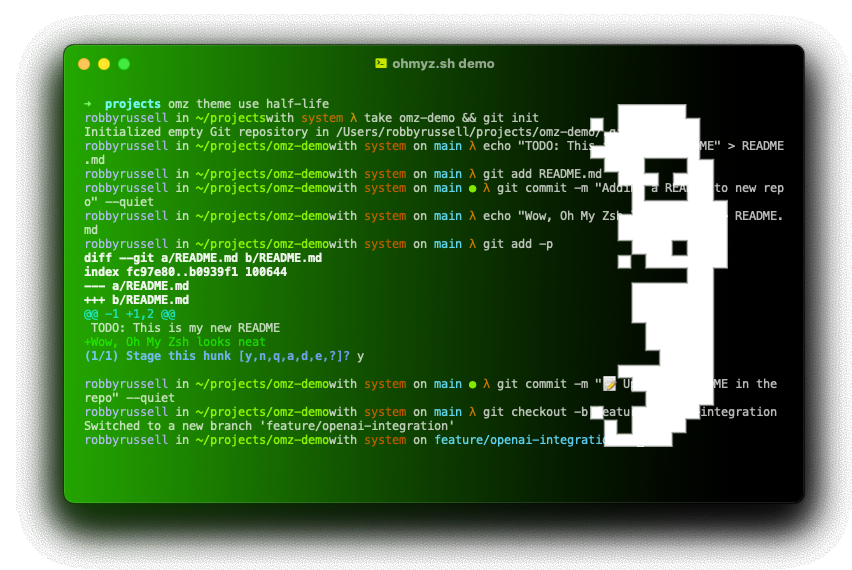

---

#    mybash 



Welcome to **mybash**  
I just wanted to be more productive while coding, so **mybash** started as a simple way to bookmark paths and commands using two short and powerful acronyms: `cmd` (for command) and `bkm` (for bookmarks). From there, everything else is history. **Let’s go!** �

---

## � Table of Contents

- [✨ Features](#features)
- [⚡ Installation](#installation)
- [�️ Structure Overview](#structure-overview)
- [⚙️ Usage](#usage)
- [� Plugins](#plugins)
- [� Logging](#logging)
- [� Testing](#testing)
- [� Contributing](#contributing)
- [� License](#license)
- [� Contact](#contact)

---

## ✨ Features

✅ **Intuitive Command Syntax** – Simplified commands for everyday tasks.  
� **Customizable Aliases** – Create shortcuts for frequently used commands.  
� **Cross-Platform Support** – Works on Linux, macOS, and Windows (via WSL).  
⚡ **Lightweight** – Minimal resource usage for smooth performance.  
� **Extensible Plugins** – Add new features with community-driven plugins.  

---

## ⚡ Installation

### � Prerequisites

- A working terminal environment (Bash, Zsh, or WSL on Windows).
- Ensure Git is installed:
  ```bash
  sudo apt install git  # For Debian/Ubuntu
  brew install git      # For macOS
  ```

### � Steps

1. Clone the repository:
   ```bash
   git clone https://github.com/yourusername/mybash.git
   ```

2. Navigate to the project directory:
   ```bash
   cd mybash
   ```

3. Run the installation script:
   ```bash
   ./install.sh
   ```

4. Restart your terminal to start using **mybash**. �

---

## �️ Structure Overview

The **mybash** system is organized into modular components for ease of use and extensibility:

### Core Components
- **Core Scripts**: Located in `core/`, these scripts provide essential functionality:
  - `cmd.zsh`: Manage custom commands.
  - `bkm.zsh`: Manage bookmarks.
  - `utils.zsh`: Utility functions like `cpwd`, `largefiles`, etc.
  - `synch.zsh`: Synchronize bookmarks and commands.
  - `dbhelper.zsh`: Interact with the SQLite database.

### Plugins
- **Plugins Directory**: Located in `plugins/`, each plugin has its own folder with a `main.zsh` file.
  - Example: `sticky_notes/main.zsh` for managing sticky notes.

### Configuration
- **Environment Variables**: Managed via `.env` (optional).
- **Plugin Configuration**: `mybash_plugins.conf` defines enabled plugins in the format:
  ```
  sticky_notes=true
  example_plugin=false
  ```

### Data Directories
- **Logs**: Stored in `$MYBASH_DATA_DIR/log`.
- **Backups**: Stored in `$MYBASH_DATA_DIR/backup`.
- **Migrations**: Import/export data in `$MYBASH_DATA_DIR/migrate`.

### Dependencies
- **System Tools**: `tree`, `jq`, `Python 3.x`, `pip3`.
- **Python Modules**: `psutil`.

---

## ⚙️ Usage

### � Basic Commands

Start **mybash**:
```bash
mybash
```

List available commands:
```bash
mybash --help
```

### ⚡ Example Workflow

1. Add a bookmark:
   ```bash
   mybash bkm add home ~/Documents
   ```

2. Use the bookmark:
   ```bash
   mybash bkm go home
   ```

3. Add a custom command:
   ```bash
   mybash cmd add gs "git status"
   ```

4. Use the custom command:
   ```bash
   mybash cmd run gs
   ```

---

### Optional Dependencies

#### Tmuxinator
Tmuxinator is an optional tool for managing tmux sessions with predefined layouts. Due to its complex dependencies (e.g., Ruby >= 2.6.7), it must be installed manually:

1. **Install RVM (Ruby Version Manager)**:
   ```bash
   curl -sSL https://get.rvm.io | bash -s stable
   source ~/.rvm/scripts/rvm
   
   rvm install 3.2.2  # Or any version >= 2.6.7
   rvm use 3.2.2 --default

   gem install tmuxinator -v 3.3.3

   tmuxinator version  # Should show 3.3.3
   ```

---

---

## � Plugins

### Sticky Notes Plugin

This plugin allows you to manage sticky notes using a SQLite database.

#### Usage
- `sticky create <title> <content>`: Create a new sticky note.
- `sticky list`: List all sticky notes.
- `sticky delete <title>`: Delete a sticky note by title.
- `sticky help`: Show help information.

---

## � Logging

All events are logged in `$MYBASH_DATA_DIR/log/mybash.log`. Logs include metadata captured using Python scripts.

#### Key Features
- **Virtual Environment**: Logs activate a virtual environment (`venv`) to capture metadata.
- **Error Handling**: Clear feedback for Python-related errors.

---

## � Testing

Run automated tests to ensure functionality:
```bash
mybash test
```

Tests validate core commands (`cmd`, `bkm`) and plugins.

---

## � Contributing

We welcome contributions from the community! � Here’s how you can help:

1. **Fork** the repository.
2. **Create a new branch** for your feature or bugfix:
   ```bash
   git checkout -b feature-name
   ```
3. **Commit your changes**:
   ```bash
   git commit -m "Add feature or fix"
   ```
4. **Push your branch**:
   ```bash
   git push origin feature-name
   ```
5. **Open a pull request** on GitHub. �

Please ensure your code follows our coding standards and includes appropriate tests. ✅

---

## � License

This project is licensed under the **MIT License**. See the `LICENSE` file for details. �

---

## � Contact

Have questions or feedback? Let’s connect! ✉️�

� **Email**: josemanuelvigil@gmail.com  
� **GitHub**: [@yourusername](https://github.com/josevigil)  
� **Twitter**: [@yourhandle](https://twitter.com/josevigil)

---

Made with ❤️ by **Jose Vigil**

---